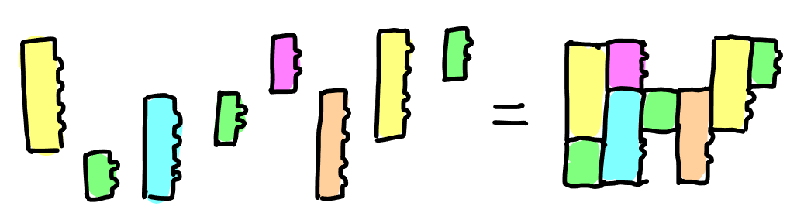
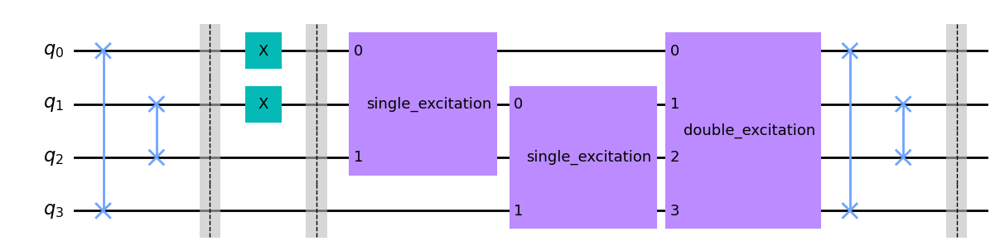
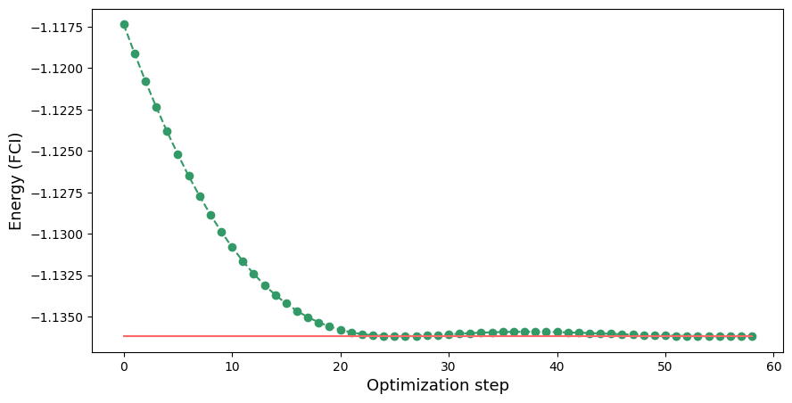
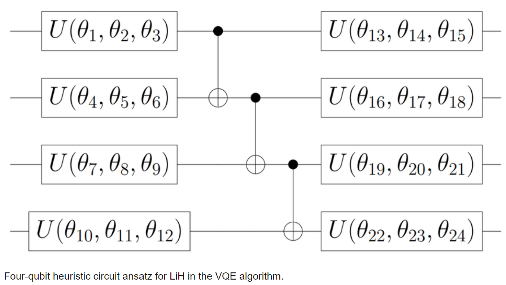
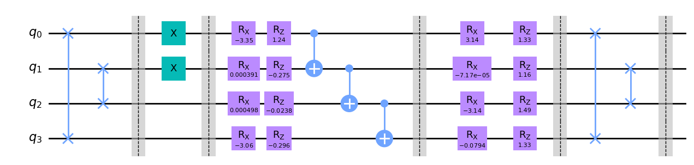
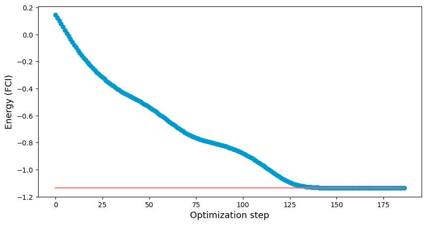

# VQE

基于 qiskit 实现的 VQE（变分量子特征值求解器）算法

文章 https://arxiv.org/pdf/1812.09976.pdf 提到，VQE 拟设大致有两种类型
physically-motivated ansatze (PMA) 与 hardware heuristic ansatze (HHA), 

1. PMA 类似于受分子物理理论的影响，设计的某种拟设，比如Givens Rotation，拟设有明确的物理意义：对应单激发或双激发，那么调参可能对应与调某种激发发生的概率

2. HHA 则类似于搭建神经网络，就是借助计算力暴力求解，搭建的拟设没有具体的物理意义，就像神经网络一样，所以精度可能不如上面的 PMA

以下考虑了 PMA 和 HHA 的两种拟设构建方式，PMA 基于 Givens Rotation，HHA 用了自设的某个量子神经网络结构。并分别就 $H_2$，*LiH* 与 $BeH_2$ 分子进行了实验计算。结果分别在 VQE-H2.ipynb，VQE-LiH.ipynb 与 VQE-BeH2.ipynb 文件中。

JW-encoding.ipynb 主要是实验初期验证论文中的 JW 编码结果哈密顿量与基于 pennylane 库得到的 JW 编码结果是一致的。

VQE-measurement.ipynb 主要是说明实际的 VQE 测量结果等于各个子哈密顿量下的测量结果的线性组合。

## PMA

基于吉文斯旋转（givens rotation）设计拟设，吉文斯旋转与基于其实现的 qiskit 算法拟设线路如下所示：

所给的线路示例为基于 $H_2$ 分子的 VQE 线路。其结果如下所示：

## HHA

基于物理可实现性较优的量子神经网络（Quantum Neural Networks）设计拟设，QNN 与基于其实现的 qiskit 算法拟设线路如下所示：

所给的线路示例同样为基于 $H_2$ 分子的 VQE 线路。其结果如下所示：

